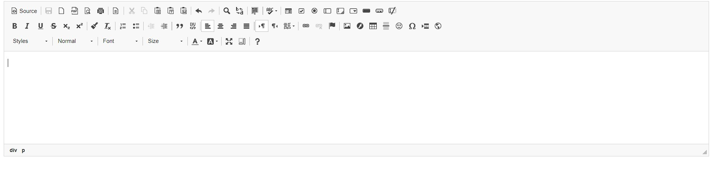

# [Monaco Editor] for [WonderCMS]

## Author
- mjuksel: https://github.com/mjuksel

## Description

This [WonderCMS] plugin adds Microsoft's [Monaco Editor], best known for powering [VSCode]

---

## Preview

---

## How to use

1. Login to your [WonderCMS] website.
2. Click "Settings" and click "Plugins".
3. Find plugin in the list and click "install".
4. Each of the editable areas will get an editor!
5. Pressing Ctrl+S will save!

[wondercms]: https://github.com/robiso/wondercms/
[monaco editor]: https://github.com/microsoft/monaco-editor/
[vscode]: https://github.com/microsoft/vscode/
